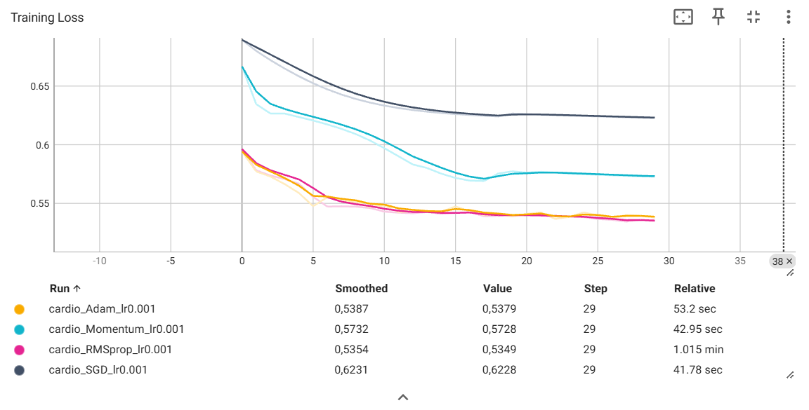
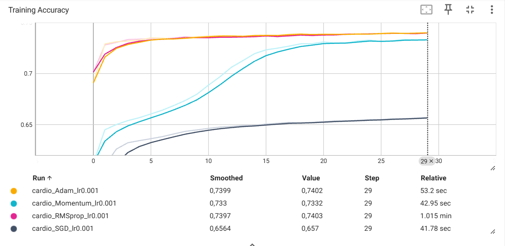

# TP2 – Régularisation, optimisation et métriques

## 1. Dataset personnalisé

### 1.1 Data leakage avec `StandardScaler`

Dans le code fourni, `StandardScaler()` est appliqué sur l'ensemble du dataset avant la séparation en ensembles d'entraînement, de validation et de test.

C'est une mauvaise pratique car le scaler calcule notamment la moyenne et l'écart-type en utilisant également les données de validation et de test. Des informations provenant du jeu de test sont donc indirectement utilisées pendant la préparation des données d'entraînement.

Ce phénomène est appelé **data leakage**.

La bonne méthode consiste à séparer d'abord les données, puis à ajuster le scaler uniquement sur l'ensemble d'entraînement :

```python
scaler.fit(X_train)
```

Ensuite, le même scaler est utilisé pour transformer les trois ensembles :

```python
X_train = scaler.transform(X_train)
X_val = scaler.transform(X_val)
X_test = scaler.transform(X_test)
```

Ainsi, aucune information provenant du jeu de validation ou du jeu de test n'est utilisée pour calculer les paramètres du prétraitement.

### 1.2 Dataset trop volumineux pour la RAM

Si le dataset était trop volumineux pour tenir entièrement en mémoire, par exemple 500 Go de données tabulaires, on pourrait utiliser :

```python
torch.utils.data.IterableDataset
```

`IterableDataset` permet de lire les données progressivement au lieu de charger l'ensemble du dataset en mémoire. Il est donc adapté au streaming ou aux datasets très volumineux.

---

## 2. Régularisation L1 / L2

### 2.1 Expérience avec `l1_lambda = 0.1` et `l2_lambda = 0`

Avec :

```python
l1_lambda = 0.1
l2_lambda = 0
```

nous observons :

La loss passe de **6.6479** à la première epoch à **1.6340**, puis reste pratiquement constante jusqu’à la fin de l’entraînement. L’accuracy reste quant à elle autour de **50 %** (0.5018 à la première epoch et 0.5011 à la dixième).

**Observation :**  
Cela montre que le modèle n’apprend pratiquement pas à distinguer les deux classes. La régularisation L1 est trop forte : elle pénalise fortement les poids du réseau et les pousse vers zéro, ce qui limite excessivement la capacité du modèle. Ce phénomène correspond à du **sous-apprentissage (underfitting)**.

### 2.2 Régularisation L2 automatique avec PyTorch

L'argument de l'optimiseur permettant d'appliquer automatiquement une régularisation L2 est :

```python
weight_decay
```

Par exemple :

```python
optimizer = optim.SGD(
    model.parameters(),
    lr=0.01,
    weight_decay=1e-3
)
```

### 2.3 Différence entre L1 et L2

La régularisation **L1** utilise la somme des valeurs absolues des poids :

$$
L_1 = \sum_i |w_i|
$$

Elle tend à pousser certains poids jusqu'à zéro et favorise donc un modèle **sparse** (parcimonieux), avec certains paramètres inutilisés.

La régularisation **L2** utilise la somme des carrés des poids :

$$
L_2 = \sum_i w_i^2
$$

Elle pénalise particulièrement les poids de grande amplitude et tend à rendre l'ensemble des poids plus petits, sans nécessairement les rendre exactement nuls.

Ainsi, **L1 favorise davantage des poids nuls**, tandis que **L2 réduit globalement l'amplitude des poids**.

---

## 3. Comparaison des optimiseurs et TensorBoard

### 3.1 Courbes TensorBoard





### 3.2 Quel optimiseur converge le plus rapidement initialement ?

D'après les courbes TensorBoard obtenues, **Adam converge légèrement le plus rapidement pendant les premières epochs**, même si ses performances sont très proches de celles de RMSprop.

Dès la première epoch, Adam obtient une loss de **0.5942**, contre **0.5963** pour RMSprop, **0.6667** pour Momentum et **0.6894** pour SGD.

Après trois epochs, les losses sont :

- Adam : **0.5729**
- RMSprop : **0.5737**
- Momentum : **0.6266**
- SGD : **0.6721**

Adam et RMSprop convergent donc nettement plus rapidement au début que Momentum et SGD. Adam est légèrement devant pendant les premières epochs.

### 3.3 Comparaison entre SGD et Momentum

Les courbes montrent que **Momentum converge beaucoup plus rapidement que SGD simple**.

À la première epoch, la loss de SGD est de **0.6894**, contre **0.6667** avec Momentum. Après 10 epochs, SGD atteint une loss de **0.6359**, tandis que Momentum atteint déjà **0.6036**.

À la fin des 30 epochs :

- SGD : loss = **0.6228**, accuracy = **0.6570**
- Momentum : loss = **0.5728**, accuracy = **0.7332**

L'ajout du momentum permet de prendre en compte une partie des mises à jour précédentes du gradient. Lorsque plusieurs gradients successifs vont dans une direction similaire, le momentum accumule cette direction et accélère la descente.

Il peut également réduire certaines oscillations pendant l'optimisation.

Dans notre expérience, l'ajout du momentum permet donc une descente de gradient **plus rapide et plus efficace** que SGD simple.

---

## 4. Analyse des métriques

Le modèle présentant la plus faible loss sur l'ensemble de validation est **RMSprop**, avec une validation loss de **0.5419**.

Les performances obtenues sur l'ensemble de test sont :

| Métrique | Valeur |
|---|---:|
| Precision | 0.7658 |
| Recall | 0.6790 |
| F1-score | 0.7198 |
| AUC | 0.8017 |

### 4.1 Définition de la Precision et du Recall

La **Precision** mesure, parmi tous les exemples prédits positifs par le modèle, la proportion qui est réellement positive.

$$
Precision = \frac{TP}{TP + FP}
$$

où :

- `TP` = vrais positifs ;
- `FP` = faux positifs.

Dans notre contexte, cela correspond à :

> Parmi les patients prédits comme malades, combien sont réellement malades ?

Le **Recall** mesure, parmi tous les exemples réellement positifs, la proportion correctement détectée par le modèle.

$$
Recall = \frac{TP}{TP + FN}
$$

où `FN` représente les faux négatifs.

Dans notre contexte :

> Parmi tous les patients réellement malades, combien sont détectés par le modèle ?

### 4.2 Precision ou Recall dans le contexte médical ?

Dans le contexte de la détection d'une maladie cardiovasculaire, il est généralement préférable de privilégier un **Recall élevé**.

Un faux négatif correspond à un patient réellement malade que le modèle classe comme sain. Ce type d'erreur peut être particulièrement problématique, car le patient pourrait ne pas être détecté et donc ne pas bénéficier d'examens ou d'une prise en charge supplémentaire.

Un Recall élevé permet donc de réduire le nombre de patients malades non détectés.

La Precision reste néanmoins importante afin d'éviter un nombre trop élevé de faux positifs.

### 4.3 Intérêt de l'AUC

La Precision, le Recall et le F1-score sont calculés ici à partir d'un seuil fixe de **0.5** pour transformer les probabilités prédites en classes.

L'**AUC**, ou *Area Under the ROC Curve*, évalue au contraire la capacité du modèle à distinguer les deux classes pour différents seuils de décision.

Elle fournit donc une mesure plus globale de la capacité de discrimination du modèle et ne dépend pas uniquement du choix du seuil `0.5`.

Une AUC proche de **1** indique une très bonne capacité à distinguer les classes, tandis qu'une AUC proche de **0.5** correspond à une discrimination proche du hasard.

Dans notre expérience, l'AUC obtenue est de **0.8017**, ce qui indique que le modèle possède une bonne capacité à discriminer les deux classes.